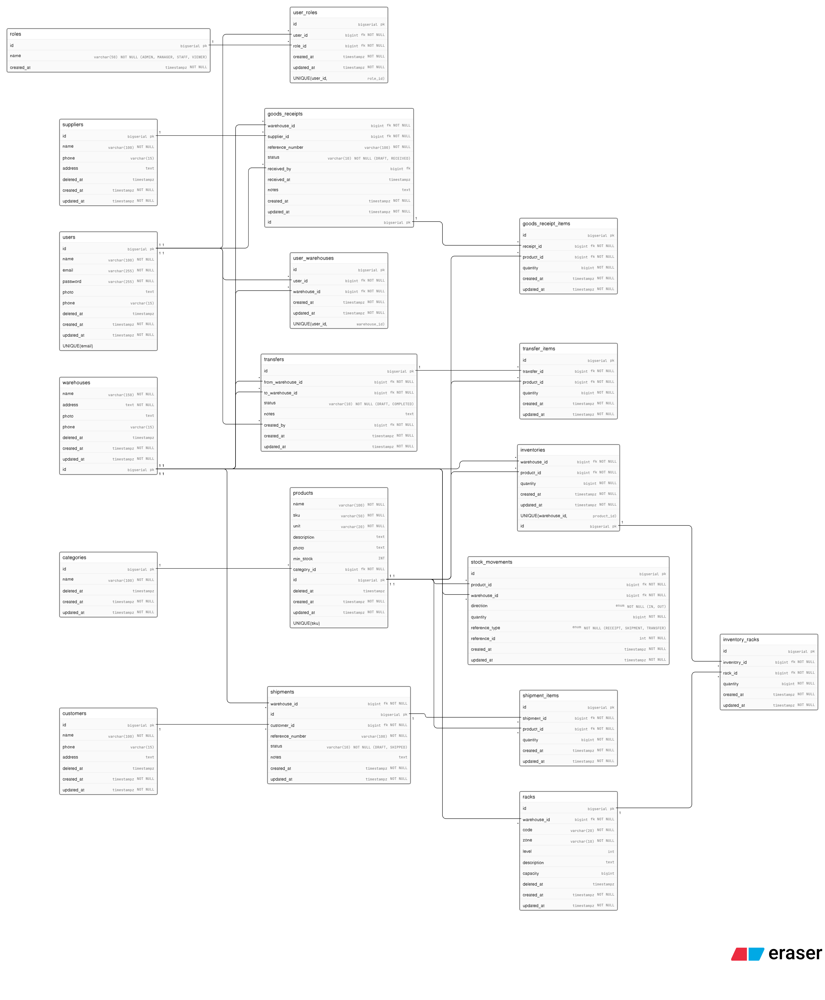

# RBAC access in Warehouse Management System (ADMIN, MANAGER, STAFF, VIEWER) explain below 👇

## ADMIN

Full access to all features. For IT admin or director of operations

- ##### User management
  Create, read, update, delete, assign role, assign warehouse
- ##### Warehouse
  Create, read, update, delete
- ##### Product & Category
  Create, read, update, delete
- ##### Supplier & Customer
  Create, read, update, delete
- ##### Rack
  Create, read, update, delete
- ##### Goods Receipt
  Create, read, update, approve, delete
- ##### Shipment
  Create, read, update, approve, delete
- ##### Transfer
  Create, read, update, approve, delete
- ##### Inventory
  Read, adjustment manual
- ##### Stock Movement
  Read
- ##### Report
  Full access

## MANAGER

Manage day-to-day warehouse operations. Cannot manage users and system configurations.

- ##### User management
  Read only (seeing list of all staff)
- ##### Warehouse
  Read only
- ##### Product & Category
  Create, read, update
- ##### Supplier & Customer
  Create, read, update
- ##### Rack
  Create, read, update
- ##### Goods Receipt
  Create, read, update, approve
- ##### Shipment
  Create, read, update, approve
- ##### Transfer
  Create, read, update, approve
- ##### Inventory
  Read, adjustment manual
- ##### Stock Movement
  Read
- ##### Report
  Full access

## STAFF

Warehouse operator. Can only input transactions, cannot approve or change master data. STAFF can only access the data warehouse they are assigned to

- ##### User management
  ❌
- ##### Warehouse
  Read only
- ##### Product & Category
  Read only
- ##### Supplier & Customer
  Read only
- ##### Rack
  Read only
- ##### Goods Receipt
  Create (DRAFT only), read
- ##### Shipment
  Create (DRAFT only), read
- ##### Transfer
  Create (DRAFT only), read
- ##### Inventory
  Read only
- ##### Stock Movement
  Read only
- ##### Report
  Terbatas — hanya data warehousenya sendiri

## VIEWER

Read-only. For auditors, accountants, or management who only need to view the report.

- ##### ALL MODULE
  Read Only
- ##### Report
  Read Only

#### Important Business Logic, Transaction Status and who can change it

DRAFT → made by STAFF, MANAGER, ADMIN
RECEIVED → only MANAGER and ADMIN (for Goods Receipt)
SHIPPED → only MANAGER and ADMIN (for Shipment)
COMPLETED → only MANAGER and ADMIN (for Transfer)

Staff may only make transactions in DRAFT status. The person who approves and changes the status is the MANAGER or ADMIN. Used for the audit trail, there is a separation between input and approval

##### Database diagram

